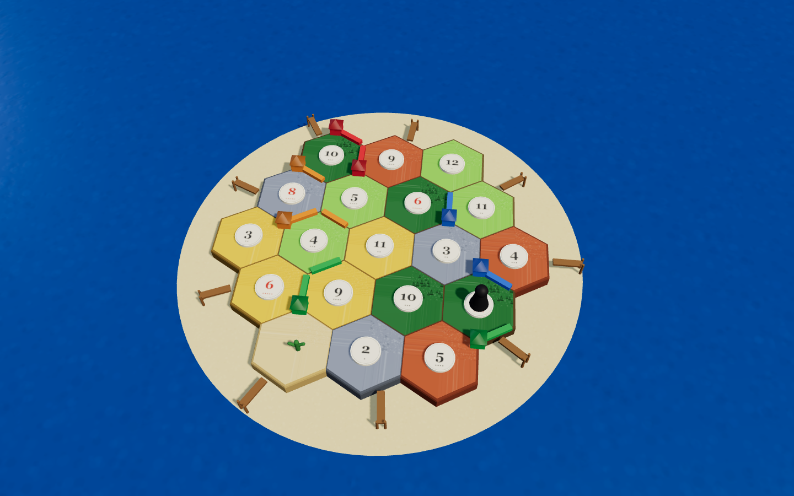
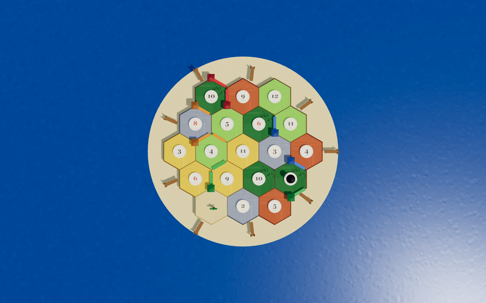
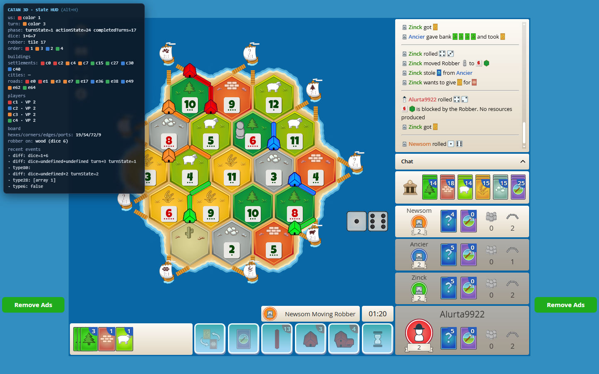
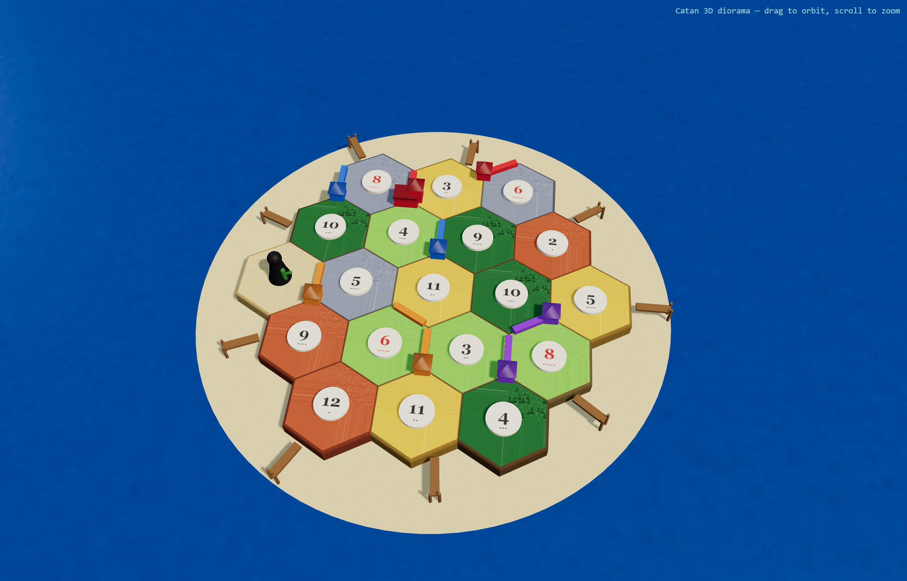

# Catan 3D — a real-time 3D board for Colonist.io

A Chrome extension (Manifest V3) that replaces [Colonist.io](https://colonist.io)'s 2D game
board with a **real-time, good-looking 3D board rendered in Three.js** — driven entirely by the
game's own WebSocket traffic, and playable through the 3D view.

> Personal visualization/enhancement tool for a game I have an account on. Colonist's Terms of
> Use don't prohibit third-party tools or protocol inspection, and an open ecosystem of
> userscripts already exists for the site.



The board above is **our Three.js render mirroring a live Colonist game** — settlements, roads,
robber, number tokens and resource tiles are all reconstructed purely from intercepted WebSocket
frames, in real time, with **zero desync** from Colonist's own state.

|  Our 3D board (top-down)  |  Colonist's real 2D board (same game)  |
|:-------------------------:|:--------------------------------------:|
|  |  |

---

## What works

**Phase 1 — State reconstruction (✅ Gate 1 passed)**
- MAIN-world `WebSocket` interceptor installed at `document_start`, capturing both directions.
- Wire format reverse-engineered empirically: **MessagePack** over a single socket
  (`wss://socket.svr.colonist.io`), incoming `{id,data:{type,payload}}`, outgoing channel-framed.
  See [`NOTES.md`](NOTES.md) — the source of truth.
- A full `GameState` model applies the snapshot + every incremental event (build, roll, robber,
  steal, trade, dev card, turn/phase changes) and stays exactly in sync with the live game.
- An on-page debug HUD prints the reconstructed state (toggle **Alt+H**).

**Phase 2 — 3D rendering (✅ Gate 2 passed)**
- A "realistic diorama" board: procedurally-generated PBR hex tiles (per-resource textures +
  normal maps), raised number-token discs (red 6/8), houses/cities/roads in player colours, a
  distinct robber pawn, wooden dock jetties, a lit rippled sea and a sandy island.
- `ACESFilmic` tone mapping, soft shadow maps, key + hemisphere + rim lighting, OrbitControls.
- Mounts over Colonist's hidden `#game-canvas` and updates reactively per event — no full rebuilds.



**Phase 3 — Interactions (✅ interaction layer complete)**
- Clicking a target in the 3D scene raycasts to a vertex/edge/hex, checks legality, and places
  the piece by **direct WebSocket send**. (Colonist's WebGL input requires *trusted* events, so
  synthetic clicks don't work — direct-send is cleaner anyway and needs no pixel calibration.)
- Every game action verified against live state with **zero desync**:

  | Action | Wire | Status |
  |--------|------|--------|
  | Build settlement | `action 15` (cornerIndex) | ✅ |
  | Build road | `action 11` (edgeIndex) | ✅ |
  | Build city | `action 19` (cornerIndex) | ✅ |
  | Move robber | `action 3` (hexIndex) | ✅ |
  | Discard on 7 | `action 2` (per card) | ✅ |
  | End turn / pass | `action 6` | ✅ |

- A legal-move engine (distance rule, road connectivity, city-on-own-settlement, robber hexes)
  gates every click so only valid moves are highlighted or sent.
- Full **initial placement** (both settlements + both roads) plays start-to-finish through the
  3D layer, and cities/robber all work — see the example round below.

---

## Example round

`node harness/example-round.js` plays a bot game's setup + several turns **entirely through the
3D interaction layer** and captures the result. A recent run:

```
setup settlements: 2   setup roads: 2   main turns: 4   rolls: 66   desyncs: 0
```

Zero desync between our reconstructed state and Colonist's actual game, start to finish. The
showcase images above are from this run.

---

## Known limitation

A fully-**autonomous 10-VP win** by the built-in strategy player isn't reached yet: with only two
starting settlements the game is resource-starved (a 400-iteration test never accumulated even
one wood + one brick together for a single road), so climbing to a win needs **bank-trades** — a
multi-step trade-UI flow whose action id isn't reverse-engineered yet. The interaction layer
itself is complete; the gap is game-playing competence, not the primitives. A human can already
play a full game through the 3D board.

---

## Architecture

```
extension/
  manifest.json              MV3: MAIN-world interceptor + isolated content script
  src/content.js             isolated-world bootstrap (loads modules, HUD, mounts board + Forwarder)
  src/protocol/
    interceptor.js           MAIN world: patches WebSocket, direct-send + postMessage bridge
    decode.js                MessagePack decode/encode + Colonist framing
  src/state/gameState.js     applies snapshot + diffs -> live model
  src/render/
    scene.js                 Three.js diorama renderer
    materials.js             procedural PBR tile/token/water/sand materials
    boardGeometry.js         hex axial<->world math + adjacency
    mount.js                 overlays the 3D canvas on Colonist's board
    hud.js                   on-page debug HUD (Alt+H)
  src/interact/
    legal.js                 legal-move computation
    forward.js               3D click -> raycast -> legal -> direct-send
    controller.js            turn/phase state machine
  vendor/                    Three.js (bundled, no CDN)
harness/                     Playwright dev/test harness
NOTES.md                     the reverse-engineered protocol — source of truth
```

## Running it

**Load the extension** — `chrome://extensions` → enable **Developer mode** → **Load unpacked** →
select the `extension/` folder → open [colonist.io](https://colonist.io) and start a game. The
debug HUD appears top-left (toggle **Alt+H**).

> Chrome 137+ blocks the CLI `--load-extension` flag on the stable channel, so the dev harness
> injects the same source modules via Playwright `addInitScript`; the shipped `extension/` loads
> normally via **Load unpacked** and needs no such mechanism.

**The Playwright harness** (development) drives real Chrome against a dedicated profile:

```bash
cd harness && npm install          # installs Playwright + three
node login-once.js                 # ONE TIME: log into Colonist in the dedicated profile
node example-round.js              # play a round via the 3D layer + capture screenshots
node capture.js                    # dump raw WebSocket frames to debug/frames/
node gate2.js                      # mount the 3D board over a live game
```

`.colonist-profile/` (your session) and `.profile-clones/` are git-ignored and must never be
committed.

## Design decisions

- **All protocol-specific logic lives in `src/protocol/`** — a Colonist wire-format change breaks
  only that one module.
- **Direct-send, not synthetic clicks** — Colonist's WebGL canvas ignores untrusted events.
- **No remote code, no external servers** — Three.js is vendored; everything runs client-side.
- The 3D→pixel calibration (RANSAC on number-token discs, ~6px) was solved but is off the critical
  path since direct-send uses board indices, not pixels.

🤖 Built with [Claude Code](https://claude.com/claude-code).
